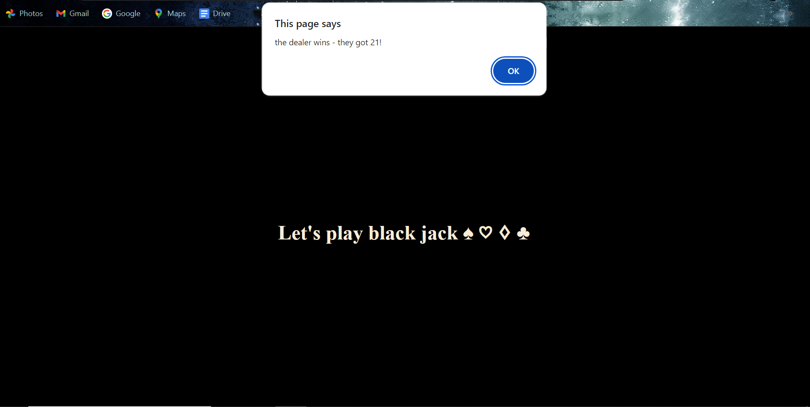

# Simple Blackjack Game (player vs computer)

## Project status
This project is complete.

## Description
A short JavaScript skills challenge for myself to make a basic blackjack game vs the computer and using what I have learned so far on javascript. The aim was to better my understanding of writing in JavaScript, with a focus around javascript functions. The page showcases a few basic calculations, including a random card generator for both player and "dealer" as well as added and compared scores.

https://rowankinross.github.io/simple-blackjack-game/

## Visuals
The following image shows the appearance of the application:

## Installation
n/a

## Usage
Opening the application you can see a basic html page, before confirms and alerts begin to pop up, as you begin the game. Following it through, you can choose to either stick or hit and subsequently your score will be totalled - over 21 and you will reach 'bust'. The same goes for the "dealer". Refresh the page to play again.

## Contributing
As this is a personal project, designed to challenge and test my skills, I am not currently looking for contributors.

## Credits

edX challenge materials for setting the challenge and providing me with the skills to take on this project.

## License

MIT License - refer to LICENSE in the repo.